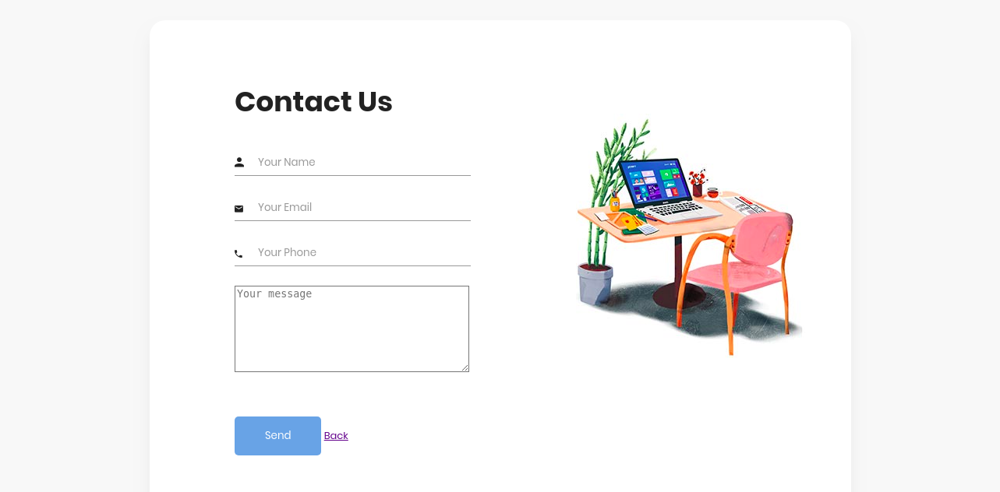
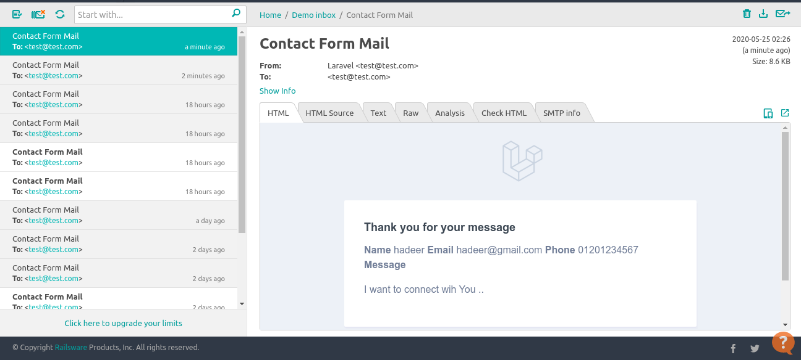
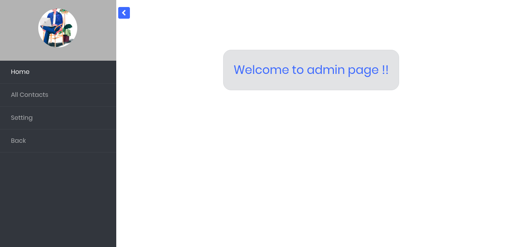
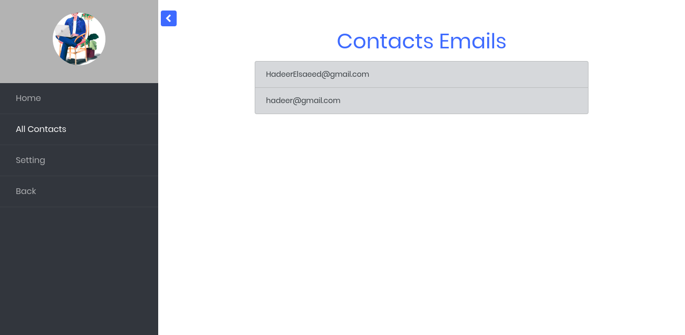
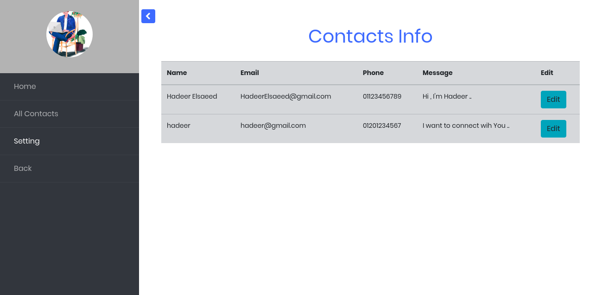
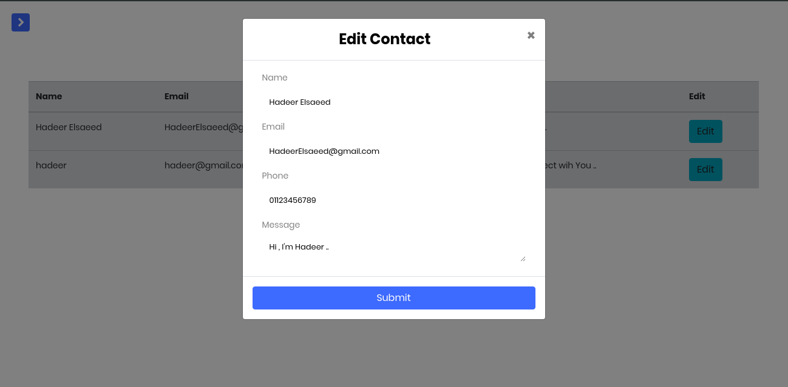

### Installation
- Firstly, install laravel 7 and all extensions https://laravel.com/docs/7.x .
- secondly, install apache and mysql or install lampp .

### To Run App
- open lampp ,start apache and mysql.
- In cmd run --> php artisan migrate , php artisan module:migrate ContactUS , php artisan module:migrate Admin .
- run server using command --> php artisan serve 

### Contact Us
- Main app contains two links for modules.

- I create two modules [contact us - Admin] according to https://github.com/nWidart/laravel-modules
- In module "ContactUs", i send email using "mailable" and test this using   https://mailtrap.io/

- In module "Admin" , There is two pages for admin..

